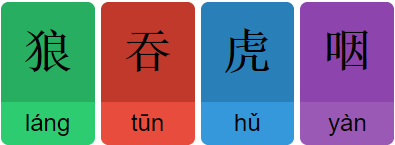
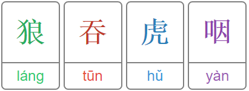
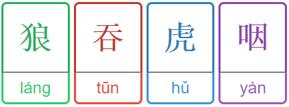
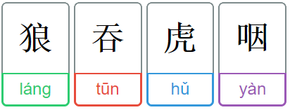

# Anki chinese template

The idea of this Anki template is to make it easier to associate hanzi with pinyin and the corresponding tone.
Hanzi and pinyin are wrapped in a box with a color that corresponds to a tone. The project uses JS inside the cards to take the contents of the fileds Hanzi and Pinyin to create the colored boxes around each character. The style of the card can easily be customized.

style1 | style2
:------|------:
 | 
style3 | style4
 | 

## Usage

Anki and Ankidroid allow the user to create their own card types. To use this template, create a new card type. Then add the for card fields ***Hanzi***, ***Pinyin***, ***Translation*** and ***Hint***. Make sure that they all start with uppercase characters and that there are no spelling errors, else the card might not work properly.  
Now there should be three text fields that allow you to change the appearance of cards. The fields should be ***front template***, ***style***, ***back tempate***. Now take the contents of build/anki/front.html and paste them all into the ***front template***, take the contents of build/anki/back.html into the ***back tempate*** and finally take one of the style\<X\>.css files and copy that file's contents into the ***style***. Afterwards you should be good to go.

## How to write chinese cards properly

To create the layout the number of *chunks* for pinyin and hanzi have to fit. For hanzi every character is a chunk. Also an array of symbols that are no chinese characters is a chunk. For pinyin, letters that may or may not be followed by a number are considered as a chunk.

#### Example
```
我是从...來的.
wo3 shi4 cong2 ... lai2 de .
```
Corresponding Chunks are:

我 | 是 | 从 | ... | 來 | 的 | .
:--|----|----|-----|----|----|--:
wo3 | shi4 | cong2 | ... | lai2 | de | .

Note that the three dots in the hanzi are not separated by whitespace while the three dots in the pinyin have to be separated by a whitespace.

For the translation, to have multiple translations in different lines, just separate them with a semicolon.

#### Example
```
This is the first line ; And this one the next line
```
The above line will be displayed as:
```
This is the first line
And this one the next line
```

## Colors

This template has a custom color coding. But can be changed to fit color codings of other programs.

| tone 		| color 	|
|-----------|-----------|
| first  	| red 		|
| second 	| green 	|
| third 	| blue 		|
| forth 	| purple 	|
| fifth/no 	| gray 		|

The colors can be changed in style\<X\>.css. Each of those files contain styles for hanzi and pinyin with a class for each tone. E.g.:
```css
// style1.css
hanzi.tone1 { background-color: #C0392B; }
hanzi.tone2 { background-color: #27AE60; }
hanzi.tone3 { background-color: #2980B9; }
hanzi.tone4 { background-color: #8E44AD; }
hanzi.tone5 { background-color: #7F8C8D; }

pinyin.tone1 { background-color: #E74C3C; }
pinyin.tone2 { background-color: #2ECC71; }
pinyin.tone3 { background-color: #3498DB; }
pinyin.tone4 { background-color: #9B59B6; }
pinyin.tone5 { background-color: #95A5A6; }
```
Here the colors can simply be replaced by any valid color.