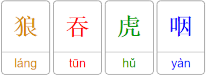
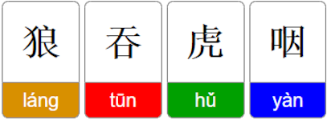

# Anki chinese template

The idea of this Anki template is to make it easier to associate hanzi with pinyin and the corresponding tone.
Hanzi and pinyin are wrapped in a box with a color that corresponds to a tone. The project uses JS inside the cards to take the contents of the fileds Hanzi and Pinyin to create the colored boxes around each character. The style of the card can easily be customized.

style1 | style2
:------|------:
 | 
style3 | style4
 | 
style5 | style6
 | 

## Usage

To be able to use the chinese template execute the following steps:
- Create a new ***note type*** and give it a name of your choice.
- Add the 4 fields ***Hanzi***, ***Pinyin***, ***Translation*** and ***Hint*** to your new note type. Make sure that the field names contain no typos.
- Edit the appearance of the cards. You should see a menu that has 3 fields for the ***front***, ***back*** and ***styling*** of the cards.
- Navigate to <https://github.com/adrianderstroff/anki-chinese-template/tree/master/build/anki>.
- There take the contents of the file ***front.html*** and copy them in Anki into the ***front*** text field.
- Take the contents of the file ***back.html*** and copy them in Anki into the ***back*** text field.
- Take one of the ***styleX.css*** files and copy it's contents in Anki into the ***styling*** text field. In the previous section you have an overview of the different styles.

Now you are ready to create cards with the new note type. The following section will describe how to write cards using this template.

## How to write the chinese cards

To create the layout the number of *chunks* for pinyin and hanzi have to fit. For hanzi every character is a chunk. Also up to three dots are a chunk, so that you can write ... and those dots will be grouped together. If you want to have a normal dot after ... simply type another dot, so basically four dots in a row.  This will be interpreted as "..." ".". Make sure that no whitespace is used for the hanzi. 

For pinyin, combinations of characters separated by whitespaces are grouped into chunks. To specify the tone for a chunk the last character has to be a number between 1 and 5, those numbers correspond to the tones used in most dictionaries. If no number is specified at the end it is implicitly assumed to be tone number 5.

#### Example
```
我是从...來的.
wo3 shi4 cong2 ... lai2 de .
```
Corresponding Chunks are:

我 | 是 | 从 | ... | 來 | 的 | .
:--|----|----|-----|----|----|--:
wo3 | shi4 | cong2 | ... | lai2 | de | .

Note that the three dots in the hanzi are not separated by whitespace while the three dots in the pinyin have to be separated by a whitespace.

For the translation and hint, to have multiple translations or hints in different lines, just separate them with a semicolon ";".

#### Example
```
This is the first line ; And this one the next line
```
The above line will be displayed as:
```
This is the first line
And this one the next line
```

#### Annotating translation

It is now possible to annotate the word typ of the translation. The word types are **noun**, **verb**, **measure word**, **adjective**, **adverb**. To annotate a translation, the annotation has to be the first non-whitespace word in a line. As shown above a translation and hint can be split into different lines by using semicolon as a delimiter. 

So the corresponding annotations of the word types are **n:**, **v:**, **mw:**, **adj:**, **adv:**. Make sure that the : is part of the annotation and the annotations have to be lowercase. The result of the annotation is a colored circle at the beginning of a line.

In the translation field you could for example write something like this:
```
n: worker ; v: to work ; mw: 个 ; adj: hardworking ; adv: hardworkingly
```

| word type    | annotation | color 	|
|--------------|------------|-----------|
| noun  	   | n:         | red 		|
| verb 	       | v:         | blue   	|
| measure word | mw:        | yellow 	|
| adjective    | adj:       | blue  	|
| adverb 	   | adv:       | purple 	|


## Colors

This template has a custom color coding. But can be changed to fit color codings of other programs.

| tone 		| color 	|
|-----------|-----------|
| first  	| red 		|
| second 	| green 	|
| third 	| blue 		|
| forth 	| purple 	|
| fifth/no 	| gray 		|

The colors can be changed in style\<X\>.css. Each of those files contain styles for hanzi and pinyin with a class for each tone. E.g.:
```css
// style1.css
hanzi.tone1 { background-color: #C0392B; }
hanzi.tone2 { background-color: #27AE60; }
hanzi.tone3 { background-color: #2980B9; }
hanzi.tone4 { background-color: #8E44AD; }
hanzi.tone5 { background-color: #7F8C8D; }

pinyin.tone1 { background-color: #E74C3C; }
pinyin.tone2 { background-color: #2ECC71; }
pinyin.tone3 { background-color: #3498DB; }
pinyin.tone4 { background-color: #9B59B6; }
pinyin.tone5 { background-color: #95A5A6; }
```
Here the colors can simply be replaced by any valid color.